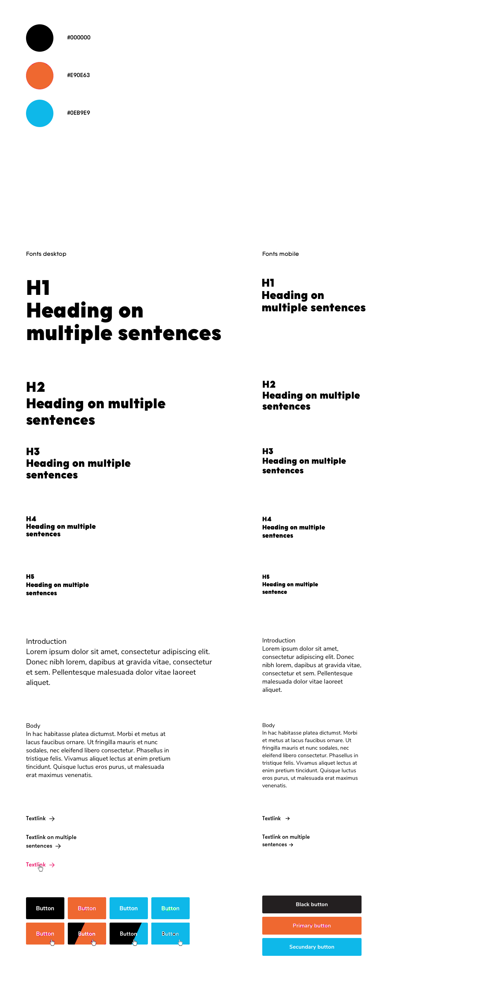
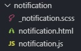

<p align="center">
  
</p>

<h1 align="center">Project Tech Course @cmda-bt 19-20</h1>

<p align="center"><b>Get together on Festivibe</b>
</p>

<br>

<p align="center">
  <a href="https://project-tech-team.herokuapp.com/">
    
  </a>
  &nbsp;&nbsp;&nbsp;
  <a href="https://choosealicense.com/licenses/gpl-3.0/">
    
  </a>
</p>

<br>

<p align="center">


</p>

<br>

## Introduction

This dating web app is made as part of a course from @cmda-bt 19-20. In this course we had to make a dating app, together as a team.

You can find a live version of the dating app here: <a href="#">Include link</a>

## Table of Contents

- [Installation](#installation)
- [Styleguide](#styleguide)
- [Stack](#application)
  - [Templating](#templating)
    - [Views](#views)
    - [Components](#components)
  - [Styling](#styling)
  - [JavaScript](#javascript)
  - [Database](#database)
    - [Setup](#setup)
      - [Database Connect](#database-connect)
      - [Database User Schema](#database-user-schema)
    - [Table example](#table-example)
  - [Authentication](#authentication)
  - [Validation](#validation)
  - [Cache control](#cache-control)
  - [Linting](#linting)
  - [Setup and build](#build-and-setup)
    - [Setup](#setup)
    - [Build](#build)
      - [Directories](#directories)
      - [Images](#images)
      - [CSS](#css)
      - [JavaScript](#javascript)
- [Needs testing](#needs-testing)
- [Known bugs](#known-bugs)
- [Wishlist](#wishlist)
- [Credits](#credits)
- [Sources](#sources)
- [License](#license)

## Installation

Please read the [Attribution-NonCommercial-NoDerivs 3.0 Unported License (“BY-NC-ND 3.0”)](https://creativecommons.org/licenses/by-nc-nd/3.0/) before you download and use this application and/or material.

<details>
  <summary>Show me the installation steps!</summary>

1. Open your terminal

2. Change the directory to a folder in which you want to clone the files

```bash
cd /~path
```

3. Clone the repository (you're going to need [Git](https://www.linode.com/docs/development/version-control/how-to-install-git-on-linux-mac-and-windows/))

```bash
git clone https://github.com/Mennauu/pt-team-19-20.git
```

4. Change directory to repository in your terminal

```bash
cd pt-team-19-20
```

5. Create a .env file in the root of the repoistory and insert underneath lines. Replace the SESSION_SECRET with a secret of your choice.

```bash
ENVIRONMENT=local

LOCAL_URI=http://localhost:3000/

SESSION_SECRET=Place your own secret here
```

6. Install dependencies from [package.json](https://github.com/Mennauu/browser-technologies-1819/blob/master/package.json)

```bash
npm install
```

7. Run application with [Node](https://nodejs.org/en/) in development mode

```bash
npm run dev
```

</details>

## Styleguide

<details>
  <summary>Show me the styleguide!</summary>



</details>

## Stack

<details>
  <summary>Show me the stack explanation!</summary>

  <br>

HTMLovers is a [server-side rendered](https://www.freecodecamp.org/news/what-exactly-is-client-side-rendering-and-hows-it-different-from-server-side-rendering-bd5c786b340d/) dating web application. You can create an account, setup your information and match with other users based on the given information.

HTMLovers is created using mainly [HTML](https://developer.mozilla.org/nl/docs/Web/HTML), [SCSS](https://sass-lang.com/), [JavaScript](https://developer.mozilla.org/en-US/docs/Learn/JavaScript/First_steps/What_is_JavaScript), [Nunjucks](https://mozilla.github.io/nunjucks/), [NodeJS](https://nodejs.org/en/), [Express](https://expressjs.com/) and [MongoDB](https://www.mongodb.com/).

### Templating

[Nunjucks](https://mozilla.github.io/nunjucks/) is used as a templating engine to render HTML. Nunjucks has been chosen for its easy way of creating macro's, so building component based views is made better, cleaner, easier and above all, more readable.

#### Views

One default layout has been created for every page on the website. The content from the different pages are injected within a `block content`. It might be the case that you have a _generic_ element that's shown on every page. Look at the code below for a small example, a generic element in this project is a header.

```HTML
<!DOCTYPE html>
<html>
  <head>...</head>
  <body>
    <!-- The header is a 'generic' element in this project because it's shown on every page -->
    

      

    
    <main>
      
        <!-- content will be injected in this block -->
      
    </main>
  </body>
</html>
```

When you want to inject content into the 'block' you have to extend the layout. You can do that like this:

```





```

For instance, this might be how your `home.html` looks.

```







  

    {{ image({
      image: '/assets/images/test.jpeg',
      alt: 'Test'
    }) }}

  


```

#### Components

As you might have seen in the `views` sections, I'm not actually writing any HTML. I'm calling elements like a header, card and image and providing them information. How does that work? Check out the "notification" component underneath, written as a macro.

```HTML


  <div class="c-notification  {{ data.class }}" js-hook-notification>

      <p class="notification__message">

        {{ data.message }}

      </p>

  </div>


```

I'm defining a macro called notification that contains data. Within the macro I write some HTML which defines the macro. The data within the `if` statements are only shown if you provide the macro with the given data (by name). See that `js-hook-notification`? That's added to call the element in JavaScript, so we don't get messy stuff like searching for a class named notification.

In our view template we can now easily call the macro by importing it like this at the top of the view file:

```javascript

```

Afterwards, we can call the macro within our view.

```javascript
{
  {
    notification({
      message: 'This is a message',
      class: 'notification__test',
    })
  }
}
```

Now if we don't want to render a class, we can just leave it empty or not mention it at all. The if statement within the macro will be false.

**How does a component folder look like?**

In case of the notification folder in my project it looks like this:



Inside the notification folder you can find the HTML, CSS (well ok, SASS) and JavaScript. 3 files that only belong to that given component.

Building components/macros like this makes them reusable. You can reuse them anywere on your site, and also someone else that might start to code within your project. Heck, you can even use the component in different projects.

### Styling

[SASS](https://sass-lang.com/) has been used for styling. It's full of features and actually makes your CSS richer. It's also faster to write SCSS than regular CSS, especially when working component based. The main reason for using SASS over other CSS extensions (or writing regular CSS) is the ability to write variables, functions, and mixins.

Let's take a look again at the `notification` component. It has a SCSS file named \_notification.scss. The underscore is a partial for SCSS. It basically means that the file is going to be imported to a `main` stylesheet, in my case `main.scss`. The advantage of using partials is that you can use many files to organize your code and everything will be compiled within a single file. Back to the notifcation..

<details>
  <summary>Show me your _notication.scss file!</summary>

```SCSS
$notification-transition-speed: 400ms;
$notification-z-index: 10;
$notification-shadow: 0 5px 10px rgba($color-black, 0.15);
$notification-border-radius: 3px;
$notification-background-color: $color-white;
$notification-padding: $global-spacing-sm;
$notification-margin: $global-spacing-md;
$notification-width: $global-spacing * 40;
$notification-color: $color-red;
$notification-font: $font-stack-secondary;
$notification-weight:  $font-weight-bold;

.c-notification {
  background-color: $notification-background-color;
  border-radius: $notification-border-radius;
  box-shadow: $notification-shadow;
  padding: $notification-padding;
  opacity: 0;
  visibility: hidden;
  position: fixed;
  left: $notification-positioning;
  max-width: 100%;
  color: $notification-color;
  font-weight:$notification-weight;
  font-family: $notification-font;
  margin-right: $notification-margin;

  @include screen-tablet-portrait-and-bigger {
    max-width: $notification-width;
  }
}

.notification--is-active {
  opacity: 1;
  visibility: visible;
  z-index: $notification-z-index;
  transition: visibility $notification-transition-speed, opacity $notification-transition-speed;
}
```

</details>
<br>

As you can see at the top of the files we define a lot of variables. We do this in order to make the component reusable within different projects. For instance, if you use this component within another project, the only thing (in most cases) you will have to do is give values to the variables on top. You don't have to touch the code beneath the variables.

Variables like `$global-spacing` and `$color-red` are globally defined variables, that can be used in every SCSS file. Notice the `@include screen-tablet-portrait-and-bigger`? That's a @mixin that we defined globally. It looks like this:

```SCSS
@mixin screen-tablet-portrait-and-bigger {
  @media only screen and (min-width: em($tablet-portrait-start)) {
    @content;
  }
}
```

All SCSS files are eventually compiled to one css file, which is compressed, revisioned, and minified, on save or build. More about that later!

### JavaScript

All JavaScript (files) being used are imported in a `main-es.js` file, like this:

```JavaScript
import FormLogin from '@components/form-login'
import moduleInit from '@utilities/module-init'
```

moduleInit reads the dom for elements. You can call it like this:

```JavaScript
moduleInit.sync('[js-hook-form-login]', FormLogin)
```

It will look for an element in the DOM with a data-attribute called `js-hook-form-login`. If an element has been found it will create a new Class, like: `new Class(FormLogin)`.

In the `FormLogin` javascript file it will look like the code underneath. We can call the element directly from the constructor.

```javascript
class FormLogin {
  constructor(element) {
    this.form = element

    this.bindEvents()
  }

  bindEvents() {
    ...
  }

  ...
}
```

Another note: all HTML element that contain some JavaScript actions are called by a data-attribute called js-hook followed by the name of the element. For instance, `js-hook-input-username`.

In a JavaScript file at the top I will create a variable like this.

```javascript
const JS_HOOK_INPUT_USERNAME = '[js-hook-input-username]'
```

To be able to find the element I can now do something in the likes of this

```javascript
const inputUsername = document.querySelector(JS_HOOK_INPUT_USERNAME)

// Maybe I'm calling a input inside a form that's been called by ModuleInit?
// We can find an element by adding the line underneath in the constructor.
this.inputUsername = element.querySelector(JS_HOOK_INPUT_USERNAME)
```

_All in the name of readability._

### Database

In order to create accounts, save account details and be able to match with other users, we need a **database**. The project is made using JavaScript, NodeJS and Express; [mongoDB](https://www.mongodb.com/) is a perfect database when using these tools, because MongoDB is a document database, which means it stores data in JSON-like documents. [Mongoose](https://mongoosejs.com/) is used as a boilerplate in order to make life a little easier.

#### Setup

_Disclaimer: passwords are hashed with [bcrypt](https://www.npmjs.com/package/bcrypt). bcrypt is used since it has proven to be a realiable encryption method, also passport (which we use for authentication) has an easy integration flow for bcrypt._

<details>
  <summary>Show me the database connection setup and user schema</summary>

#### Database connect

```javascript
class Database {
  constructor() {
    this.connect()
  }

  connect() {
    mongoose.connect(uristring, { useNewUrlParser: true })
  }
}
```

#### Database user schema

```JavaScript
const userSchema = new mongoose.Schema({
  username: String,
  password: String,
  name: String,
  age: Number,
  gender: String,
  attraction: String,
  fromAge: Number,
  toAge: Number,
  level: String,
  avatar: String,
  images: [],
  firstVisit: Boolean,
  liked: [],
  disliked: [],
  matched: [],
})
```

</details>

#### Table example

| \_id `objectId`          | images `array` | liked `array`                                            | disliked `array` | matched `array` | username `string` | password `string`                                               | firstVisit `boolean` | age `int` | gender `string` | level `string` | name `string` | avatar `string`                                   | attraction `string` | fromAge `int` | toAge `int` |
| ------------------------ | -------------- | -------------------------------------------------------- | ---------------- | --------------- | ----------------- | --------------------------------------------------------------- | -------------------- | --------- | --------------- | -------------- | ------------- | ------------------------------------------------- | ------------------- | ------------- | ----------- |
| 5e6e3ecff612c0090673b274 | []             | ['5e6e3ecff612c0090673b274', '5e6e3ecff612c0090673b2cb'] | []               | []              | 'Baas'            | '$2a$10\$0BHov9rtizAHGoRHV2gu6.UKmMBzG4hN3GjARcYvZvmyiFqG7bWIK' | False                | 25        | 'Male'          | 'God'          | 'Menno'       | 'assets/uploads/9042463f4413e9761549565dff25b331' | 'Females'           | 18            | 30          |

### Authentication

For authentication and user sessions [Passport](http://www.passportjs.org/) has been used. Passport is an authenticaton middleware.

Passport is used because it serves one purpose: authentication. It has been fully optimized for authentication through a username and password, which is what we use to authenticate. Passport keeps your code clean and maintainable.

```javascript
passport.use(
  new LocalStrategy((username, password, done) => {
    User.findOne({ username: username }, (err, user) => {
      if (err) return done(err)
      if (!user) return done(null, false, { message: message.incorrectUsername })

      if (!user.validatePassword(password, user.password)) return done(null, false)

      return done(null, user)
    })
  }),
)
```

### Validation

Validation is done on the client, but also over the server. For most validation purposes [validator](https://www.npmjs.com/package/validator) has been used. Validator is used because we only need string validation, which is the only thing validator does. Validator has been written, checked, validated and maintained by over 250 real tech-nerdy people. They can probably write those validation functions better and safer than I ever could.

When a form is submit by a user the request is send to server. The server checks if nothing fishy is going on. For instance, when someone tries to register an account, we have to check the username on character length size and if it contains only letters and numbers.

```javascript
// Validate username length
if (!validator.isByteLength(username, { min: 3, max: 20 })) {
  req.flash('error', message.usernameLength)

  return res.redirect('back')
}

// Check if username contains only letters and numbers
if (!validator.isAlphanumeric(username)) {
  req.flash('error', message.usernameCheck)

  return res.redirect('back')
}
```

We also perform this check on the client, but the checks can be altered on the client. They can't adjust validation on the server, which is the reason why it's important to always (also) validate requests on the server.

If something is wrong, an error message is returned to the user.

### Cache control

Since we server-side render all of our pages we can set [Response Headers](https://developer.mozilla.org/en-US/docs/Glossary/Response_header). For the HTML files I applied the underneath headers, also with the help of [Shrinky Ray](https://www.npmjs.com/package/shrink-ray-current). Shrink Ray is used to set the Etag and to compress (only) HTML with [brotli](https://github.com/google/brotli), or [gZip](https://www.gzip.org/) as fallback.

```JavaScript
shrinkRay({
  filter: req => req.headers['accept'].includes(['text/html']),
}),
```

<ul>
  <li>Cache-Control: no-cache</li>
  <li>With Etag</li>
  <li>No Server (if shown)</li>
  <li>No X-Powered-By (if shown)</li>
</ul>

For static files, such as JavaScript, CSS and images, the underneath headers are set.

<ul>
  <li>Cache-Control: public, max-age=31536000</li>
  <li>No Etag</li>
  <li>No Last-Modified</li>
  <li>No Server (if shown)</li>
  <li>No X-Powered-By (if shown)</li>
</ul>

I won't go to much into detail here, since I wrote an article about it which you can find here: [The benefits of file revisioning and cache control](https://medium.com/@mennauu/the-benefits-of-file-revisioning-and-cache-control-639a9e6c537c).

### Linting

We use [ESLint](https://www.npmjs.com/package/eslint) and [SASS-lint](https://github.com/sasstools/sass-lint) for JavaScript and SASS. Two respectable linters, which are very adjustable to your own taste. Some real strict rules are created for the linters. The lint errors will show each time you save a SASS file or JavaScript file, or when building the project.

Firstly, [Prettier](https://prettier.io/) is used to format my code on save. It's configured to solve most linting errors, if there are any formatting mistakes. For example, ESLint is told that semicolons at the end of a javascript declaration aren't allowed. So accordingly, prettier is adjusted to remove semicolons on save, to fix these errors.

<details>
  <summary>Show me your linter and prettier files!</summary>

Check out my `.prettierrc` file.

```JSON
{
  "printWidth": 100,
  "tabWidth": 2,
  "semi": false,
  "singleQuote": true,
  "trailingComma": "all",
  "bracketSpacing": true,
  "jsxBracketSameLine": true
}
```

My `.eslintrc.json` file.

```JSON
{
  "plugins": ["simple-import-sort"],
  "parser": "babel-eslint",
  "env": {
    "browser": true,
    "commonjs": true,
    "es6": true,
    "node": true
  },
  "extends": [
    "eslint:recommended",
    "plugin:prettier/recommended",
    "plugin:import/errors",
    "plugin:import/warnings",
    "plugin:import/typescript"
  ],
  "parserOptions": {
    "ecmaVersion": 2018,
    "sourceType": "module",
    "ecmaFeatures": {
      "jsx": true,
      "modules": true
    }
  },
  "rules": {
    "no-console": 0,
    "semi": 0,
    "no-prototype-builtins": 0,
    "import/no-unresolved": "off",
    "simple-import-sort/sort": "warn",
    "import/named": "off"
  },
  "ignorePatterns": ["build/assets/js/*.js"]
}
```

And lastly, my `.sass-lint.yml`

```SCSS
rules:
  space-after-colon: 0
  force-pseudo-nesting: 0
  hex-notation: 0
  space-before-colon: 0
  space-between-parens: 0
  property-sort-order: 0
  no-trailing-zero: 0
  no-css-comments: 0
  clean-import-paths: 0
  pseudo-element: 0
  leading-zero: 0
  hex-length: 0
  space-around-operator: 0
  force-element-nesting: 0
  mixins-before-declarations: 0
  no-color-literals: 0
  function-name-format: 0
  no-vendor-prefixes: 0
  class-name-format:
    - 1
    - convention: hyphenatedbem
  indentation: 0
  nesting-depth:
    - 1
    - max-depth: 4
  no-misspelled-properties:
    - 1
    - 'extra-properties':
        - 'overflow-scrolling'
files:
  ignore:
    - 'node_modules/**'
```

Just to make sure, an `.editorconfig` file is also included.

```
root = true

[*]
indent_style = space
indent_size = 2
end_of_line = lf
charset = utf-8
trim_trailing_whitespace = true
insert_final_newline = true

[*.md]
trim_trailing_whitespace = false
```

</details>

### Setup and Build

#### Setup

[Express](https://www.npmjs.com/package/express) for the server. It's one of the best frameworks for node. [ESM](https://www.npmjs.com/package/esm) is also included. ESM is a ECMAScript module loader and it allows you to write imports like this:

```JavaScript
import passport from 'passport'
```

Instead of this

```JavaScript
const passport = require('passport')
```

[Nodemon](https://www.npmjs.com/package/nodemon) is included so the server would restart whenever there were any changes made on the **server**. <br>
[Browser Sync](https://www.npmjs.com/package/browser-sync) is included so the browser would refresh whenever there were any changes made on the **client**.

[Eslint](https://www.npmjs.com/package/eslint) is included to lint all JavaScript files and [Sasslint](https://www.npmjs.com/package/sasslint) to lint all SCSS files.

[Chokidar CLI](https://www.npmjs.com/package/chokidar-cli) is used to watch all (client-side) JavaScript and SASS files, if they are adjusted it will run the specific build commands. It's also used to check if any new images have been placed in the image folder, or fonts in the font folder. It will automatically move them to the build folder, after some improvements, ofcourse.

The watch command looks like this, it's pretty long:

```JSON
"watch": "chokidar '**/*.js' -c 'npm run lint-js -s & npm run build-js && npm run revision-js' --ignore 'build/assets/js/*.js' --ignore 'server/server.js' --ignore 'server/routes/**/*' --ignore 'server/middleware/**/*' --ignore 'server/database/**/*'  --ignore 'node_modules/.cache/**/*' & chokidar '**/*.scss' -c 'npm run build-css & npm run lint-css && npm run revision-css' & chokidar 'server/assets/fonts/*' -c 'npm run move-fonts' --throttle 5000 & chokidar 'server/assets/images/*' -c 'npm run move-images' --throttle 5000"
```

#### Build

If you run `npm run dev`, you are up for some serious building. It will activate the build command:

```JSON
"build": "del build && npm run build-directories && npm run build-images && npm run build-js && npm run build-css && npm run prefix-css && npm run move-images && npm run move-fonts && npm run revision-js && npm run revision-css && npm run optimize-svgs",
```

Every command is run after the other is done. Out of precaution we firstly run a delete command using [del-cli](https://www.npmjs.com/package/del-cli) to delete the build folder, might it already exist.

Production enviroments will most of the time run `npm run start`, and usualy `npm run build` once, and afterwards prune the `devDependencies`. Though, this isn't the case for all enviroments. So changes there should be made.

#### Directories

This one is quite easy, we use [mk-dir](https://www.npmjs.com/package/make-dir) to build the necessary directories.

```JSON
"build-directories": "make-dir build && make-dir build/assets && make-dir build/assets/css && make-dir build/assets/images && make-dir build/assets/js && make-dir build/assets/fonts"
```

#### Images

The image command, shown below, will convert all images in the image folder on the server to the build image folder, with some magic. Not only the original image, but also 7 variants of the image in different resolutions in .webp format will be placed in the build image folder. [srcset](https://www.npmjs.com/package/srcset) is used to make this possible.

```JSON
"build-images": "srcset 'server/assets/images/*' --width 1920,1440,1280,1024,768,480,320 --format webp -d build/assets/images --verbose"
```

The above doesn't work for SVG's, since SVG's are practically HTML. So we run a different command for SVG's:

```JSON
"optimize-svgs": "svgo -f build/assets/images",
```

[svgo](https://www.npmjs.com/package/svgo) will optimize and minify SVG's.

#### CSS

Firstly, `scss` files had to be imported one by one in the `main.scss` file and I didn't like that. So I used [Node Sass Glob Importer](https://www.npmjs.com/package/node-sass-glob-importer) so I could use glob syntax in scss imports. This basically means you can inject any scss file from a given route, like shown underneath. This way you never have to even think of importing a file, it's done automatically.

```SCSS
@import '00_top-level/*.scss';
@import '01_settings/*.scss';
@import '02_tools/*.scss';
@import '03_generic/*.scss';
@import '04_elements/*.scss';
@import '05_themes/*.scss';
@import '06_utilities/*.scss';

/* Component Imports */
@import '../../components/**/*.scss';
```

Also when using Sass, you have to compile it to CSS in order for the browser to able to read it. For that I used [Node Sass](https://www.npmjs.com/package/node-sass). Node Sass also has a build in compression as an option, which minifies the file.

In my `package.json` I created a command named `build-css` like this:

```JSON
"build-css": "node-sass --importer node_modules/node-sass-glob-importer/dist/cli.js server/assets/sass/main.scss build/assets/css/styles.min.css --output-style compressed && npm run prefix-css"
```

At the end you can see I also run `npm run prefix-css`. When Node Sass is done creating the compressed CSS file, [postcss](https://www.npmjs.com/package/postcss) and [autoprefixer](https://www.npmjs.com/package/autoprefixer) are used to add vendor prefixes where needed (better browser compatibility, hooray!). It's done by running this command:

```JSON
"prefix-css": "postcss build/assets/css/styles.min.css -u autoprefixer --no-map --output build/assets/css/styles.min.css",
```

We now have a `styles.min.css` files which is compressed, minified and has vendor prefixes included, but we're not done yet. Lets say you make an adjustment to your styles.min.css file, but your browser has the file cached. It won't update the styles on your site. You can fix this with a hard refresh, but who does that? Only developers, not your users (and it's even annoying for developer). We can fix this problem by adding file revisioning. This simply means we will add a hash to our `styles.min.css` when we make an adjustment to our styles; it will look something like this: `styles-485f843f0.min.css`. The hash will be changed everytime.

In order to do this we have to do 2 things:

<ul>
  <li>Add hash to existing styles.min.css file, or change the hash</li>
  <li>Replace name of hashed style file in HTML (you know, the CSS link inside our `head` element)</li>
</ul>

In order to do this I run this commmand:

```JSON
"revision-css": "gulp --gulpfile server/middleware/revisioning/revision.js replace-css"
```

[Gulp](https://www.npmjs.com/package/gulp), yikes. But yes, [Gulp](https://www.npmjs.com/package/gulp), to run a task. Two tasks in fact: `revision-css` and `replace-css`. Next to Gulp, [gulp-rev](https://www.npmjs.com/package/gulp-rev) is used to append a content hash to the css file, and to create a `rev-manifest.json` in order to map the original paths to the revisioned paths, like this:

```
{
  "styles.min.css": "styles-d41d8cd98f.min.css"
}
```

Problem with that is, if you save again it will add a new object like this, and the old one will remain, since the file doesn't get deleted.

```
{
  "styles-d41d8cd98f.min.css": "styles-fev5dfve34.min.css"
  "styles.min.css": "styles-d41d8cd98f.min.css"
}
```

We use [gulp-rev-delete-original](https://www.npmjs.com/package/gulp-rev-delete-original) in order to solve this problem. It will delete the original rewritten file.

Now that the file is being revisioned perfectly, we have to replace the filename in the HTML. In order to do that we use [gulp-rev-replace](https://www.npmjs.com/package/gulp-rev-replace). It rewrite occurrences of filenames which have been renamed by gulp-rev by looking at the `rev-manifest.json` file.

Combining all the tasks together it looks like this:

```JavaScript
gulp.task('revision-css', () => {
  const srcCSS = ['../../../build/assets/css/*.css']
  const buildCssFolder = '../../../build/assets/css'
  const buildManifestFolder = '../../../build/assets'

  return gulp
    .src(srcCSS)
    .pipe(rev())
    .pipe(revDelOrig())
    .pipe(gulp.dest(buildCssFolder))
    .pipe(
      rev.manifest(`${buildManifestFolder}/rev-manifest.json`, {
        base: buildManifestFolder,
        merge: true,
      }),
    )
    .pipe(gulp.dest(buildManifestFolder))
})

gulp.task('replace-css', ['revision-css'], () => {
  const buildFolder = '../../../build/assets'
  const revisionFile = '../../views/layouts/default.html'
  const layoutFolder = '../../views/rev-layouts'
  const manifest = gulp.src(`${buildFolder}/rev-manifest.json`)

  return gulp
    .src(revisionFile)
    .pipe(revReplace({ manifest: manifest }))
    .pipe(gulp.dest(layoutFolder))
})
```

And that's all for the CSS, it's perfect!

#### JavaScript

All JavaScript files are imported into one `main-es.js` file. This doesn't mean that only 1 requests is send by the server to the browser in order to load all JavaScript. You will still do a request for every imported JavaScript file. In order to solve this we use [Rollup](https://www.npmjs.com/package/rollup), which is a module builder. In easier words, it will concatenate all the JavaScript files into one file.

The build command looks like this, it takes its configuration from a config file.

```JSON
"build-js": "rollup --config server/assets/javascript/rollup.config.js",
```

The code underneath is part of the configuration file. I actually made two configurations, one for development mode, and one for production mode. The one you see is for production mode.

```JavaScript
const productionConfig = {
  input: 'server/assets/javascript/main-es.js',
  output: [
    {
      file: 'build/assets/js/main-es.min.js',
      format: 'es',
      plugins: [terser()],
    },
    {
      file: 'build/assets/js/main.min.js',
      format: 'system',
      plugins: [terser()],
    },
  ],
  plugins: [
    resolve(),
    commonjs({
      sourceMap: false,
      namedExports: {
        debounce: ['debounce'],
      },
    }),
    json(),
    babel({
      exclude: 'node_modules/**',
      babelrc: false,
      runtimeHelpers: true,
      presets: [['@babel/env', { modules: false }]],
      plugins: ['@babel/plugin-transform-runtime'],
    }),
    prettier({ parser: 'babel' }),
    alias({
      entries: [
        { find: '@utilities', replacement: './utilities' },
        { find: '@components', replacement: '../../components' },
      ],
    }),
  ],
}
```

We give it an input, which is our file with all the javascript imports, and an output with a given format. I tell rollup to create two files, one with the `es` format, for modern browsers and one with the `system` format, for older browsers. In HTML it looks like this:

```HTML
<script type="module" async="async" src="/assets/js/main-es.min.js"></script>
<script nomodule="nomodule" async="async" src="/assets/js/main.min.js"></script>
```

The browser that support modules will just ignore the file with the nomodule attribute. After that we define some plugins:

- [Resolve](https://www.npmjs.com/package/@rollup/plugin-node-resolve) to locate modules from `node_modules`.
- [CommonJS](https://www.npmjs.com/package/@rollup/plugin-commonjs) to convert CommonJS modules to ES6.
- [Json](https://www.npmjs.com/package/@rollup/plugin-json) to convert JSON files to ES6 modules
- [Babel](https://www.npmjs.com/package/rollup-plugin-babel) to convert ES6 and ES7 javascript to ES5
- [Prettier](https://www.npmjs.com/package/rollup-plugin-babel) to run prettier (formating) on the final bundle
- [Alias](https://www.npmjs.com/package/@rollup/plugin-alias) to define aliases for file imports

With JavaScript we do the same revisioning and filename replacement as we did for CSS, so another explanation is not needed.

</details>

## Known bugs

- [ ] Adjusting the default.html doesn't automatically update the rev-default.html (you have to make an adjustment in a SASS or JS file)

## Wishlist

- [ ] More to add
- [x] This is done

## Credits

**Anyone**: Anyone we all want to credit?

## Sources

Underneath you will find sources that have been used or were helpful for the creation of this application.

- 📖: Documentation or article
- 🛠: Tool or library

> - 🛠 [Express](https://www.npmjs.com/package/express)
> - 🛠 [@express/flash](https://www.npmjs.com/package/express-flash)
> - 🛠 [@express/session](https://www.npmjs.com/package/express-session)

> - 🛠 [Passport](https://www.npmjs.com/package/express)
> - 🛠 [@passport/local](https://www.npmjs.com/package/passport-local)

> - 🛠 [Eslint](https://www.npmjs.com/package/eslint)
> - 🛠 [@eslint/eslint-config-prettier](https://www.npmjs.com/package/eslint-config-prettier)
> - 🛠 [@eslint/eslint-plugin-import](https://www.npmjs.com/package/eslint-plugin-import)
> - 🛠 [@eslint/eslint-plugin-prettier](https://www.npmjs.com/package/eslint-plugin-prettier)
> - 🛠 [@eslint/eslint-plugin-simple-import-sort](https://www.npmjs.com/package/eslint-plugin-simple-import-sort)
> - 🛠 [@eslint/eslint-utils](https://www.npmjs.com/package/eslint-utils)

> - 🛠 [Gulp](https://www.npmjs.com/package/gulp)
> - 🛠 [@gulp/gulp-cli](https://www.npmjs.com/package/gulp-cli)
> - 🛠 [@gulp/gulp-rev](https://www.npmjs.com/package/gulp-rev)
> - 🛠 [@gulp/gulp-rev-delete-original](https://www.npmjs.com/package/gulp-rev-delete-original)
> - 🛠 [@gulp/gulp-rev-replace](https://www.npmjs.com/package/gulp-rev-replace)

> - 🛠 [Rollup](https://www.npmjs.com/package/rollup)
> - 🛠 [@rollup/rollup-plugin-terser](https://www.npmjs.com/package/rollup-plugin-terser)
> - 🛠 [@rollup/rollup-plugin-prettier](https://www.npmjs.com/package/rollup-plugin-prettier)
> - 🛠 [@rollup/plugin-node-resolve](https://www.npmjs.com/package/@rollup/plugin-node-resolve)
> - 🛠 [@rollup/plugin-json](https://www.npmjs.com/package/@rollup/plugin-json)
> - 🛠 [@rollup/plugin-commonjs](https://www.npmjs.com/package/@rollup/plugin-commonjs)
> - 🛠 [@rollup/plugin-alias](https://www.npmjs.com/package/@rollup/plugin-alias)
> - 🛠 [@rollup/rollup-plugin-terser](https://www.npmjs.com/package/rollup-plugin-terser)

> - 🛠 [Babel](https://www.npmjs.com/package/@babel/core)
> - 🛠 [@babel/plugin-transform-runtime](https://www.npmjs.com/package/@babel/plugin-transform-runtime)
> - 🛠 [@babel/preset-env](https://www.npmjs.com/package/@babel/preset-env)
> - 🛠 [@babel/runtime-corejs3](https://www.npmjs.com/package/@babel/runtime-corejs3)
> - 🛠 [@babel/eslint](https://www.npmjs.com/package/babel-eslint)
> - 🛠 [@babel/runtime](https://www.npmjs.com/package/@babel/runtime)

> - 🛠 [TypeScript](https://www.npmjs.com/package/typescript)
> - 🛠 [@typeScript/eslint-parser](https://www.npmjs.com/package/@typescript-eslint/parser)

> - 🛠 [Validator](https://www.npmjs.com/packag/validator)
> - 🛠 [Number & Money formatting](https://www.npmjs.com/package/wnumb)
> - 🛠 [Node SASS](https://www.npmjs.com/packag/node-sass)
> - 🛠 [NO UI Slider](https://www.npmjs.com/package/nouislider)
> - 🛠 [Nunjucks](https://www.npmjs.com/package/nunjucks)
> - 🛠 [Range inclusive](https://www.npmjs.com/package/range-inclusive)
> - 🛠 [Shrink Ray](https://www.npmjs.com/package/shrink-ray-current)
> - 🛠 [ECMAScript module loader](https://www.npmjs.com/package/esm)
> - 🛠 [Is an image](https://www.npmjs.com/package/is-image)
> - 🛠 [Javascript Cookies](https://www.npmjs.com/package/js-cookie)
> - 🛠 [Mongoose](https://www.npmjs.com/package/mongoose)
> - 🛠 [Multer](https://www.npmjs.com/package/multer)
> - 🛠 [bcrypt.js](https://www.npmjs.com/package/bcryptjs)
> - 🛠 [Connect Flash](https://www.npmjs.com/package/connect-flash)
> - 🛠 [Cookieparser](https://www.npmjs.com/package/cookie-parser)
> - 🛠 [Debounce](https://www.npmjs.com/package/debounce)
> - 🛠 [Dotenv](https://www.npmjs.com/package/dotenv)
> - 🛠 [Flexis SRCSET](https://www.npmjs.com/package/@flexis/srcset)
> - 🛠 [Autoprefixer](https://www.npmjs.com/package/autoprefixer)
> - 🛠 [Chokidar CLI](https://www.npmjs.com/package/chokidar-cli)
> - 🛠 [Browsersync](https://www.npmjs.com/package/browser-sync)
> - 🛠 [Connect Browsersync](https://www.npmjs.com/package/connect-browser-sync)
> - 🛠 [Del CLI](https://www.npmjs.com/package/imagemin-cli)
> - 🛠 [Imagemin CLI](https://www.npmjs.com/package/imagemin-cli)
> - 🛠 [Kill port](https://www.npmjs.com/package/kill-port)
> - 🛠 [Make dir cli](https://www.npmjs.com/package/make-dir-cli)
> - 🛠 [NCP - Asynchronous recursive file & directory copying](https://www.npmjs.com/package/ncp)
> - 🛠 [Node sass glob importer](https://www.npmjs.com/package/node-sass-glob-importer)
> - 🛠 [Nodemon](https://www.npmjs.com/package/nodemon)
> - 🛠 [PostCSS CLI](https://www.npmjs.com/package/postcss-cli)
> - 🛠 [Prettier](https://www.npmjs.com/package/prettier)
> - 🛠 [Sass Lint](https://www.npmjs.com/package/sass-lint)
> - 🛠 [Select random file](https://www.npmjs.com/package/select-random-file)
> - 🛠 [SVGO](https://www.npmjs.com/package/svgo)
> - 🛠 [Node random name](https://www.npmjs.com/package/node-random-name)
> - 🛠 [Node zopfli es](https://www.npmjs.com/package/node-zopfli-es)
> - 🛠 [Iltorb](https://www.npmjs.com/package/iltorb)

> - 📖 [MongoDB Documentation](https://docs.mongodb.com/)
> - 📖 [Mozilla developer docs](https://developer.mozilla.org/nl/)
> - 📖 [Nunjucks docs](https://mozilla.github.io/nunjucks/)

## License

<a href="https://choosealicense.com/licenses/gpl-3.0/">
  
</a>
